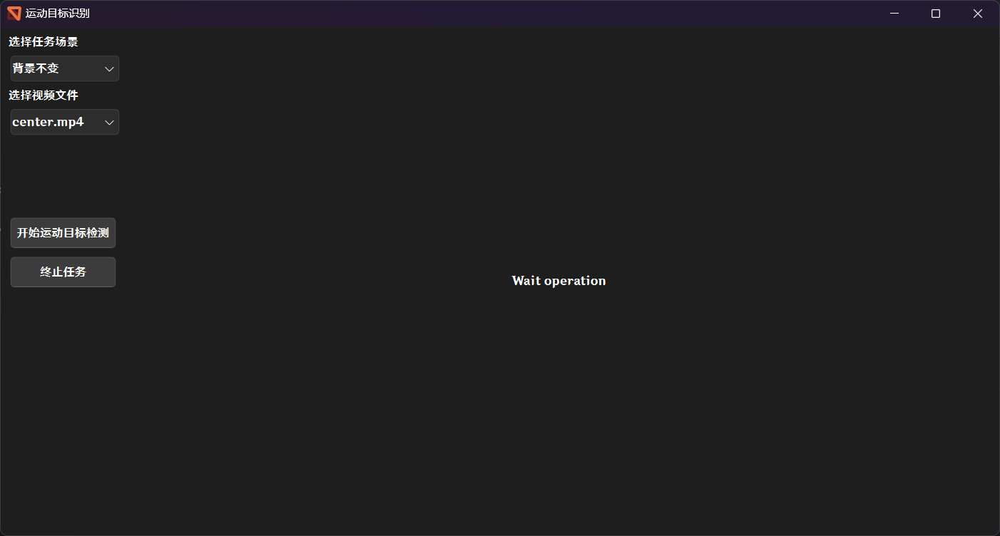

<h1 align="center">
   
  
   
  <b>Moving Object Detection System</b>
</h1>

    
    
    
    

## Requirements

- `python>=3.10`, as well as `torch>=2.3.1` and `torchvision>=0.18.1` for `sam2`
- `opencv-python` and `opencv-contrib-python` for image processing
- `pyside6` for GUI
- `scikit-learn` for cluster

## How to run

1. Install the requirements using `pip install -r requirements.txt`, recommend to use `conda`
2. Install `sam2` following [this](https://github.com/facebookresearch/segment-anything)
3. Run `python windows.py`

## Interface display

